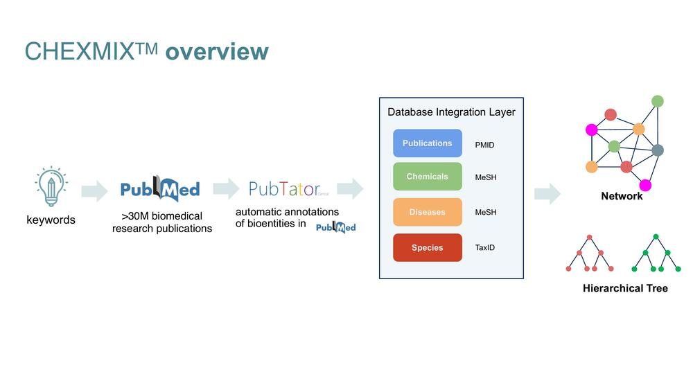
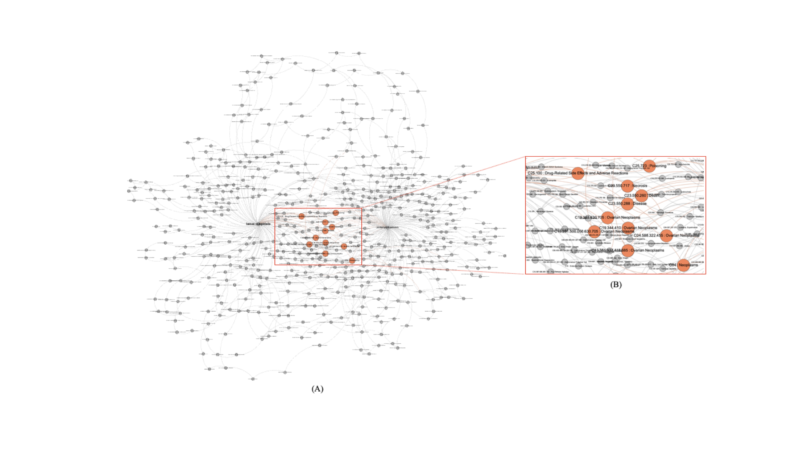

# ChexMix: a Content Extraction Tool for Bioentities in Literature
Biomedical databases grow by more than a thousand new publications every day.
The large volume of biomedical literature which are being published at an unprecedented rate hinders discovering
the relevant knowledge from keywords of interest, getting insights and forming hypotheses.
A text-mining tool, PubTator, helps automatically annotate bioentities, such as species, chemicals, genes, and diseases,
in PubMed abstracts and PMC full-text articles. However, the re-organization and analysis of bioentities by
the researchers is a non-trivial and highly time-consuming task. ChexMix was designed for the extraction of the unique 
identifiers corresponding to bioentities in query results. In the study, we used ChexMix to construct a taxonomic tree 
with allied species in Korean native plants or extract MeSH identifiers for the bioentities which co-occurred  with 
the keywords in the same literature. We applied ChexMix to discover allied species related to a keyword of interest and 
experimentally proved the usefulness of ChexMix or multi species. 



## Installation

### Download data files
Use the download scripts under `scripts`:
```
cd scripts
./download_mesh.sh
./download_taxonomy.sh
```

### Development

Install `chexmix` via `pip` for dev:
```
pip install -e <path to chexmix>
```


#### Test
Make sure you have `tox`. If not, run `pip tox`.

For unitests, run `tox`.

#### Launch Docker
Often it is convenient to work in a reproducible environment by docker, and [Jupyter docker](https://jupyter-docker-stacks.readthedocs.io/en/latest/using/common.html) is useful for it. To launch a docker container with the image:
```
docker run --rm -p 8888:8888 -v "$PWD":/home/jovyan/chemix -e JUPYTER_ENABLE_LAB=yes jupyter/datascience-notebook:latest
```

## Usage
There are 4 graph types inherited from class `BioGraph` that includes the following relationships:

| Graph types | Relationships |
| ----- | ------------- |
| `PubMedGraph` | `Keyword` -`[MENTIONED]` -> `Article` |
| `PubTatorGraph` | `Bioentity` -`[APPEARED_IN]`-> `Article` |
| `MeSHGraph` | `Bioentity` -`[INCLUDES]`-> `Bioentity` |
| `TaxonomyGraph` | `Bioentity` -`[INCLUDES]`-> `Bioentity` |


One may import relevant classes as follows:
```python
from chexmix.graph import BioGraph, TaxonomyGraph, MeSHGraph, PubTatorGraph, PubMedGraph, NodeType, EdgeType, TaxParentType
```


A graph can be created with node and edge data.
```python
nodes = [node1, node2]
edges = [(node1, node2)]
bio_graph = BioGraph(nodes, edges)
```

Also each graph has own specific factory methods; `PubMedGraph` may be built from a search keyword, `PubTatorGraph` from publication ids, and `TaxonomyGraph` and `MeSHGraph` are from the root ids of `Taxonomy` and `MeSH`, respectively:
```python
pubmed_graph = PubMedGraph.from_keyword('wnt5a')
pubtator_graph = PubTatorGraph.from_article_ids([3300312, 3300313])
tax_graph = TaxonomyGraph.from_root_ids([9606])
mesh_graph = MeSHGraph.from_root_ids(['D001234', 'D005678'])
```

### Basic Graph Opeartion
One may manipulate `BioGraph`s using various operations to get some interesting insights:

| method name | args | type | description |
| ----- | ------- | ------ | -------|
| `intersection` | `other` | `BioGraph` | returns the intersection graph of `self` with `other`|
| `difference` | `other` | `BioGraph`  | returns a graph with the nodes that exist in `self` but not in `other`|
| `union` | `other` | `BioGraph`  | returns a union graph of two graphs|
| `find_roots` | `edge_types` | `Optional[List[EdgeType]]` |  find root nodes w.r.t. `edge_types`|
| `find_leaves` | `edge_types` | `Optional[List[EdgeType]]`| find leaf nodes w.r.t. `edge_types`|
| `remain_by_node_types` | `node_types` | `List[NodeType]` | returns a graph that has nodes with `node_types`|
| `remain_by_edge_types` | `edge_types` | `List[EdgeType]` | returns a graph with edges of type `edge_types` |
| `subgraph_from_root` | `root_node`</br> `edge_types` | `str`</br>`Optional[List[EdgeType]]` | returns a subgraph of `self` including nodes connected with `root` by edges of `edge_types` |
| `total_count` | `nodes` | `List[NodeId]` | returns the sum of the attribute `count` of nodes|
| `threshold` | `threshold` | `int` | returns a graph with nodes of which attribute `count` is larger than `threshold`|
| `inherit_attr_from` | `other` | `BioGraph` | return an identical graph with updated node attributes from `other` if the node also exists in `self`|
| `set_attribute` | `attr_key`</br>`attr_value`</br> `nodes` |`str`</br>`Any`</br> `List` | update node attributes|


#### Example
For a simple demonstration, we build a graphs with Taxonomy and MeSH associated with a given keyword:

```python
# get publications associated with 'keyword' and their publication 'Id's 
pubmed_graph = PubMedGraph.from_keyword(keyword)
article_ids = pubmed_graph.get_article_ids()

# construct two graphs with bioentities of 'MeSH' and 'Taxonomy' mentioned in the publications
pubtator_graph = PubTatorGraph.from_article_ids(article_ids)
bioentities = pubtator_graph.get_bioentities('TAXO')
taxo_graph = TaxonomyGraph.from_pubtator_bioentities(TaxParentType.Genus, bioentities)
bioentities = pubtator_graph.get_bioentities('MESH')
mesh_graph = MeSHGraph.from_pubtator_bioentities(bioentities, ['D', 'C'])  # we focus only chemicals and diseases.

# Take the root nodes from 'mesh_graph' and 'taxonomy_graph', and build a summary graph that contains both root nodes and associated `keyword`
summary_graph = BioGraph().add_edges_from([(keyword, root_node) for root_node in taxo_graph.find_roots()])
mesh_entities_graph = mesh_graph.intersection(pubtator_graph)
summary_graph.add_edges_from([(keyword, appeared_node) for appeared_node in mesh_entities_graph.nodes()])
summary_graph.nodes[keyword]['type'] = "Keyword"
summary_graph.inherit_attr_from(taxo_graph.union(mesh_graph))
```

